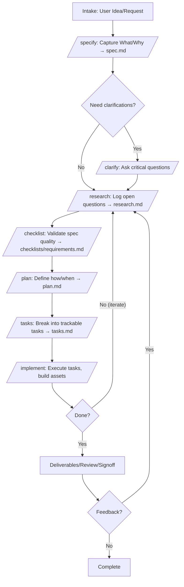

# AgentKit 🎨

**Creative idea development toolkit for AI agents**

Transform fuzzy ideas into concrete realities through structured workflows with AI coding agents. AgentKit adapts the principles of spec-driven development for creative and non-code projects.

---

## Quick Start

### Installation

**Step 1: Install Python (if you don't have it)**

Check if Python is installed:
```bash
python3 --version
```

If not installed:

*Mac (using Homebrew):*
```bash
# Install Homebrew first if needed
/bin/bash -c "$(curl -fsSL https://raw.githubusercontent.com/Homebrew/install/HEAD/install.sh)"

# Then install Python
brew install python@3.12
```

*Windows (using winget):*
```powershell
winget install Python.Python.3.12
```

*Or download from [python.org](https://www.python.org/downloads/)*

**Step 2: Install AgentKit**

```bash
python3 -m pip install git+https://github.com/hgreene624/AgentKit.git
```

**Step 3: Verify installation**

```bash
agentkit --version  # Should show v0.3.0
```

> **Note:** If `agentkit` command isn't found, you may need to add Python's bin directory to your PATH or use `python3 -m agentkit_cli` instead.

### Initialize Your First Project

```bash
# Create new project
agentkit init my-idea

# Or initialize in current directory
cd my-project-folder
agentkit init . --ai claude
```

### Start Creating (v0.3.0 Auto-Orchestrated)

```bash
cd my-idea

# Start your AI agent
claude  # or code/cursor/gemini

# Let the agent guide you through the workflow automatically
/start  # or just say "start a project about..."

# The agent will guide you through:
# constitution → specify → plan → task → implement
```

**Manual commands still work:**

```bash
/constitution    # Set your creative principles
/specify         # Capture your idea
/plan            # Define the approach
/task            # Break down into actions
/implement       # Execute and create
/status          # Check current phase progress
/skip            # Skip current phase (with confirmation)
```

### Create an Idea Workspace

```bash
agentkit idea "My first idea"
```

Creates `.agentkit/ideas/001-my-first-idea/` populated with spec, plan, tasks, research, asset-map, quickstart, checklist, and briefs folders.

---

## What is AgentKit?

AgentKit is a thinking and making tool that helps you:

1. **Articulate** fuzzy ideas into clear specifications
2. **Explore** what your idea could be through structured clarification  
3. **Plan** concrete approaches to making it real
4. **Create** the actual thing with AI agent collaboration

**Not a project management tool**—it's a creative development framework.

---

## Workflow Commands

**Auto-Orchestration (v0.3.0):**
- `/start` or `/continue` - Begin or resume auto-orchestrated workflow
- `/status` - Show current phase and progress
- `/skip` - Skip current phase (with confirmation)

**Manual Phase Commands:**
- `/constitution` - Set/refine principles (align spec)
- `/specify` - Capture your initial idea
- `/clarify` - Sharpen through structured questioning
- `/checklist` - Validate requirement quality
- `/plan` - Define the approach
- `/task` - Break down into actions
- `/implement` - Execute and create

**CLI Commands:**
- `agentkit init` - Initialize a new project
- `agentkit idea` - Create an idea workspace
- `agentkit upgrade` - Upgrade existing project to v0.3.0
- `agentkit update` - Update the CLI (pip-based; use `--use-git` for GitHub source)
- `agentkit check` - Check for installed AI agents

## Workflow (Mermaid)



Helper scripts (in `.agentkit/scripts/<shell>/`):
- `create-new-idea` – scaffold a new idea workspace
- `setup-plan` – refresh plan/tasks/research/asset-map/quickstart/checklist
- `check-prerequisites` – validate required docs exist (JSON output)
- `update-agent-context` – append notes/tech choices to `.claude/agent-context.md`
- `suggest-name` – suggest next numbered idea/feature name (uses ideas dirs + git branches)
- `tasks-export` – export tasks.md to CSV (id,status,description)
- `constitution-sync` – ensure Sync Impact Report header and copy constitution to `.agentkit/memory/constitution.md`
- `tasks-to-issues` / `tasks-to-issues-json` – export tasks to CSV/JSON for trackers
- `template-sync` – dry-run or apply template/command updates within the project
- `tasks-to-github` / `tasks-to-github-push` – generate gh commands or push issues via gh CLI

---

## Example Use Cases

- 🤖 **Automation projects** (n8n, Zapier workflows)
- 🎨 **Design collaborations** (pottery, graphics, branding)
- 📝 **Content development** (blog series, documentation)
- 🎪 **Experience design** (events, workshops)
- 🔄 **Process creation** (workflows, SOPs)
- 💡 **Business ideas** (product concepts, services)

---

## Supported AI Agents

- ✅ Claude Code (Anthropic)
- ✅ GitHub Copilot (in VS Code)
- ✅ Codex
- ✅ Cursor
- ✅ Gemini CLI (Google)

---

## Project Structure

After initialization:

```
my-idea/
├── constitution.md          # Your creative principles
├── spec.md                  # Project specification (/specify)
├── plan.md                  # Implementation plan (/plan)
├── tasks.md                 # Task breakdown (/task)
├── research.md              # Clarifications and decisions
├── asset-map.md             # Assets/elements and relationships
├── quickstart.md            # How to run/pilot/smoke-test the work
├── checklists/requirements.md  # Spec/decision quality checklist
├── briefs/                  # Standards/constraints per deliverable
├── deliverables/            # Your actual outputs
├── notes/                   # Additional documentation
├── .agentkit/              # Internal (templates, scripts, memory)
└── .claude/                # Agent commands
    └── commands/
        ├── constitution.md
        ├── specify.md
        ├── clarify.md
        ├── plan.md
        ├── task.md
        └── implement.md
```

---

## Philosophy

### "I have an idea. Help me think it through, then make it real."

AgentKit treats the AI agent as a **creative thinking partner**, not just a code generator.

**The Process:**
1. You bring the fuzzy idea
2. Agent helps you sharpen it through conversation
3. Together you define the approach
4. Agent helps create the actual thing

---

## Documentation

- **Installation Guide**: See `INSTALL.md`
- **Contributor Guide**: See `AGENTS.md`
- **Examples**: Coming soon
- **Command Reference**: In `.agentkit/` command files

---

## Contributing

Contributions welcome! This is an early-stage project.

---

## Acknowledgments

Inspired by GitHub's [SpecKit](https://github.com/github/spec-kit) and adapted for creative and non-code projects.

---

## License

MIT License - see LICENSE file for details.

---

**AgentKit** - Transform ideas into reality with AI agents 🚀
